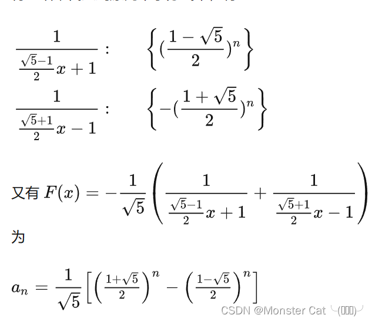

#  生成函数  (构造问题)

## 1.数列→函数

$$
F(x) = a_0 + a_1x+ a_2x^2 +……+a_nx^n+……
$$

这样的函数其数列为  {a0 a1 a2 ……  an}   为该数列的生成函数

  

```c++
eg: {1,1,1,1,1……}  一组全为1的公式其生成函数
    F(x) = 1 + x + x^2 + x^3 + x^4 + x^5 + x^6 …… 
    1/(1-x) = F(x) = 1 + x + x^2 + x^3 + x^4 + x^5 + x^6 …… 
    
    从 1/(1-x) → 推导
    广义牛顿二项式
```

](<../../../_resources/屏幕截图 2023-07-26 222137.png>)
$$
\frac{1}{(1-x)} → \frac{1}{(1-x)^p}  \\
\frac{1}{(1+x)^p} =  \sum_{r=0}^{\infty}{-p \choose r}{x^r} \\
{-p \choose r}  =  \frac{(-p)(-p-1)……(-p-r+1)}{(r!)}
=\frac{(-1)^r(p)(p+1)……(p+r-1)}{(r!)} \\
= \frac{(-1)^r(r+1)(r+2)……(p+r-1)}{(1*2*……*(p-1))} \\
= (-1)^r{p+r-1 \choose p-1}\\
\frac{1}{(1+x)^p} =  \sum_{r=0}^{\infty}{-p \choose r}{x^r}=  \sum_{r=1}^{\infty} (-1)^r{p+r-1 \choose p-1}{x^r}\\
x换元-x\\
\frac{1}{(1-x)^p} =  \sum_{r=0}^{\infty}{p+r-1 \choose p-1}{x^r}\\
$$

```c++
/*
  斐波那契数列
  F(x) = 0 + x + x^2 + 2x^3 + 3x^4 + 5x^5 + 8x^6 ……
  求F(x)的通式
  其中a = {0,1,1,2,3,5……}  其为斐波那契数列  
  f(0) = 0 , f(1) = 1   f(n) = f(n - 1) + f(n - 2)
  //错位相消 无穷项 
  F(x) =  f(0)x^0 + f(1)x^1 + f(2)x^2 + f(3)x^3 + f(4)x^4 ……
  xF(x) =           f(0)x^1 + f(1)x^2 + f(2)x^3 + f(3)x^4 + f(4)x^5 ……
  x^2F(x) =                   f(0)x^2 + f(1)x^3 + f(2)x^4 + f(3)x^5 + f(4)x^6 ……
  
  F(x) = x / (1 - x - x ^ 2)  
  其x / (1 - x - x ^ 2)  =  {0,1,1,2,3,5,8} 
*/
```

我们得知斐波那锲求其通项公式

](<../../../_resources/屏幕截图 2023-07-27 110155.png>)




## 2.卷积

$$
F(x) = a_0 + a_1x + a_2x^2 +……+a_nx^n+…… \\
G(X) = b_0 + b_1x + b_2x^2 +……+b_nx^n+…… \\
F(X) * G(X) = a_0*b_0 + (a_1*b_0 + b_1*a_0)x + (a_0*b_2+a_1*b_1+a_2*b_0)x^2 ……
$$


$$
\frac{1}{(1-x)} = 1 + x + x^2+x^3+……\\
F(x) * \frac{1}{(1-x)} =  a_0 + (a_0 + a_1)x + (a_0+a_1+a_2)x^2 ……
$$
卷积后发现每一项都是Sn
$$
1^2+2^2+3^2+4^2……\\
F(x) = 0 + 1x + 4x^2+9x^2……
$$

$$
\frac{1}{(1-x)} = 1 + x + x^2+x^3+……\\
\frac{1}{(1-x)^2} = 1 + 2x + 3x^2 + 4x^3+……\\
\frac{1}{(1-x)^3} = 1 + 3x + 6x^2 + 10x^3+……\\
\frac{x}{(1-x)^3} = 0 + 1x + 3x^2 + 6x^3 + 10x^4 +……\\
\frac{1+x}{(1-x)^3} = 1 + 4x + 9x^2 + 16x^3 + 25x^4 +……\\
\frac{x(1+x)}{(1-x)^4} = 0 + 1x + 5x^2 + 14x^3 + 30x^4 + 55x^5 +……=\frac{x}{(1-x)^4}+\frac{(x^2)}{(1-x)^4}\\
= \sum_{r=0}^{\infty}{2+r \choose 3}{x^r} +  \sum_{r=0}^{\infty}{1+r \choose 3}{x^r}
=\sum_{r=0}^{\infty}\frac{n(n+1)(2n+1)}{6}{x^r}
$$

## 3 例题

[J-一道计数题_文远知行杯广东工业大学第十六届程序设计竞赛 (nowcoder.com)](https://ac.nowcoder.com/acm/contest/30896/J)

](../../../_resources/T.png)

    eg   3 5    n = 3  m = 5
       A : 1 2 1
       B ：1 2 1    2 2 1    1 3 1  1 2 2      1 + 2 + 3 + 2 = 8

1.b(i) >= a(i)

想法： 这里我们列举所有可能情况然后进行卷积构造
](<../../../_resources/屏幕截图 2022-04-03 133045.png>)

k我们代表 0 ，1， 2，3…… m
f(x) = b0x^0 + b1x^1 + b2 x^2 + ……+ bk x^k
这时候这个构造函数我们只需要将b0 + b1 + b2 + b3 + b4 +……+ bk的和
上满那个例子
b0 = 0   b1 = 0  b2 = 0  b3 = 0  b4 = 1  b5 = 2 + 2 + 3 = 7

现在我们需要求对应的b0 b1 b2 b3 b4 b5
对A中的ai进行牛顿二项式构造  m代表正无穷
C(i , a0)     f(x) = C(0,a0) x^0^ + C(1,a0) x^1^ + C(2,a0) x^2^ + …… +C(n,a0)x^m^   
C(i , a1)     f(x) = C(0,a1) x^0^ + C(1,a1) x^1^ + C(2,a1) x^2^ + …… +C(n,a1)x^m^  
C(i , a2)     f(x) = C(0,a2) x^0^ + C(1,a2) x^1^ + C(2,a2) x^2^ + …… +C(n,a2)x^m^ 
……
C(i , an)     f(x) = C(0,an) x^0^ + C(1,an) x^1^ + C(2,an) x^2^ + …… +C(n,an)x^m^ 
这里用卷积可以求出对应  x^0^ x^1^ x^2^ x^3^ x^4^ …… x^k^

对于该例子：  **(C(0,a0) * C(0,a1) * C(0,a2))** x^0  + **(C(1,a0) * C(0,a1)  * C(0,a2) + C(0,a0) * C(1,a1) * C(0,a2)  + C(0,a0) * C(0,a1) * C(1,a2) )** x^1 + () x^2 同理  因为前面都为0所以我们直接来写x^5的情况

a0 = 1  a1 = 2  a2  = 1

5 0 0    0 5 0   0 0 5    4 1 0   4 0 1   0 4 1   1 4 0     1 0 4    0 1 4     3 2 0    3 0 2    0 3 2    2 3 0     2 0 3   0 2 3
……   其实写了这些你会发现基本都为0  所以我们写出几个不为0的情况   2 2 1    1 3 1     1 2 2 其余情况均为0            

(C(2,a0) * C(2,a1) * C(1,a2) + C(1,a0) + C(3,a1) + C(1,a2) + C(1,a0) * C(2,a1) * C(2,a2)) x^5^   
里面为7

所以我们便可以生成一个构造函数（说白了k就是在后面生成的构造函数中截取了一段）
](<../../../_resources/屏幕截图 2022-04-03 141014.png>)
$$
\frac{x^t}{(1-x)^{n+t}} =  x^t \sum_{k=0}^{\infty}{k+n+t-1 \choose n+t-1}{x^k}\\
= \sum_{k=0}^{\infty}{k+n+t-1 \choose n+t-1}{x^{k+t}} =  \sum_{k=0}^{\infty}{k+n-1 \choose n+t-1}{x^k}
$$
     变上项求和](<../../../_resources/屏幕截图 2022-04-03 161213.png>)

$$
{n\choose k} = {n-1 \choose k - 1} + {n - 1 \choose k}\\

\sum_{l=0}^{n}{l \choose k} = {0 \choose k} + {1 \choose k} +……+{k \choose k}+……+{n \choose k}\\

{n+1 \choose k+1} = {n \choose k} + {n \choose k+1} =  {n \choose k} + {n-1 \choose k} +{n -1 \choose k + 1}\\
= {n \choose k} + {n-1\choose k} + {n - 2 \choose k} + {n -3 \choose k}+……+{0 \choose k} + {0 \choose k+1}
$$
m =  5  n = 3   t = 1+2+1  = 4   C(8,7) = 8 

```c++
#include<bits/stdc++.h>

using namespace std;

const int MOD = 1e9 + 7;

int mpow(int x , int y = MOD - 2) {
    int ret = 1;
    while (y) {
        if (y & 1) ret = 1ll * ret * x % MOD;
        x = 1ll * x * x % MOD;
        y >>= 1;
    }
    return ret;
}

int main() {
    cin.tie(nullptr)->sync_with_stdio(0);

    int N , m;
    cin >> N >> m;

    int u = m + N;

    int sum = 0;
    for (int i = 1 ; i <= N ; i++) {
        int x;
        cin >> x;
        sum += x;
        if (sum >= MOD) sum -= MOD;
    }

    if (m + N < N + sum) {
        cout << "0\n";
    } else {
        int ans = 1 , d = 1;
        for (int i = 1 ; i <= N + sum ; i++) {
            ans = 1ll * ans * (u - i + 1) % MOD;
            d = 1ll * d * i % MOD;
        }
        d = mpow(d);
        cout << 1ll * ans * d % MOD << endl;
    }
    return 0;
}
```

