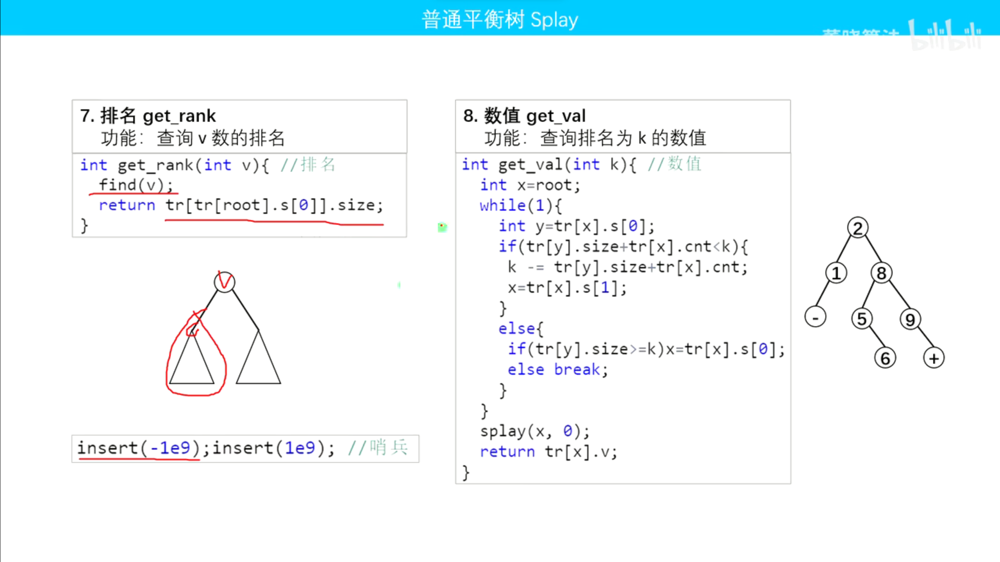

# 平衡树-Splay
## 1. BST：介绍（二叉查找树）
1. 当前节点的左子树中的任何一个点的权值小于当前点权值
2. 当前节点的右子树中的任何一个点的权值都严格大于当前点权值
3. 一般考虑中序遍历（一定是严格递增序列）
4. 动态维护一个有序序列（集合）

## BST：核心操作
1. 插入数值x
2. 删除数值x
3. 求数值x的前驱/后继
4. 找最大/最小值
5. 查询排名为x的数值
6. 查询数值x的排名
7. 查询比数值x大的最小值
8. 查询比数值x小的最大值
9. 左旋/右旋

